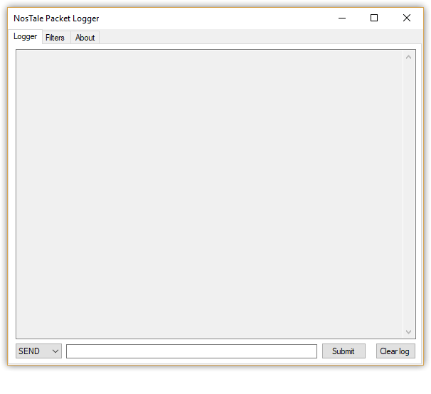
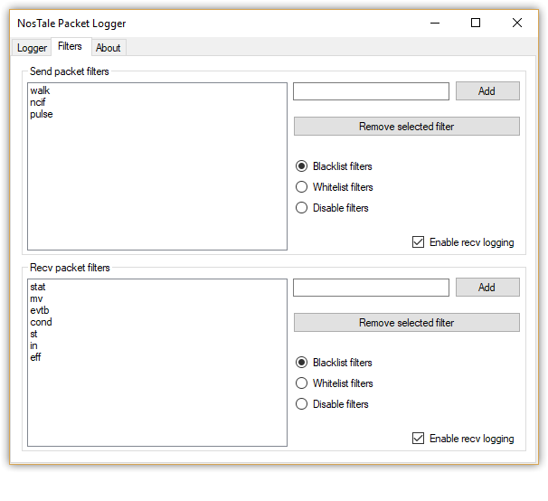

# nostale-packet-logger
A packet logger for the MMORPG NosTale.

## How to use
1. Download the latest dll version [here](https://github.com/Gilgames000/nostale-packet-logger/releases)
2. Launch NosTale game client
3. [Inject](https://www.google.com/search?q=how+to+inject+a+dll) into `NostaleClientX.exe`
using your preferred dll injector
4. Enjoy!

## How to build from source
1. Clone or download the repository
2. Open the solution with Visual Studio 2017 or above
3. Switch the build configuration to Release (building the dll as Debug will not work
unless you turn off  incremental linking, which is disabled by default in Release mode)
4. Build the solution

## Screenshots

## Troubleshooting
If you find any bugs or get an error while using the application, please
[open an issue](https://github.com/Gilgames000/nostale-packet-logger/issues)
or contact me (check contacts below).  

When filing a new bug, please include:

#### What to include in a bug report?
- Descriptive title
- Detailed steps to reproduce the bug
- Expected behaviour and what happens instead
- Screenshots if you think it's needed

## License
This project is licensed under the MIT License - see the [LICENSE](https://github.com/Gilgames000/nostale-packet-logger/blob/master/LICENSE) file for details

## Acknowledgements
- [NosTale SDK](http://atom0s.com/forums/viewtopic.php?f=21&t=151)
- [x86 API Hooking Demystified](http://jbremer.org/x86-api-hooking-demystified/)
- [Signature/Pattern Scanning](https://wiki.alliedmods.net/Signature_Scanning)

